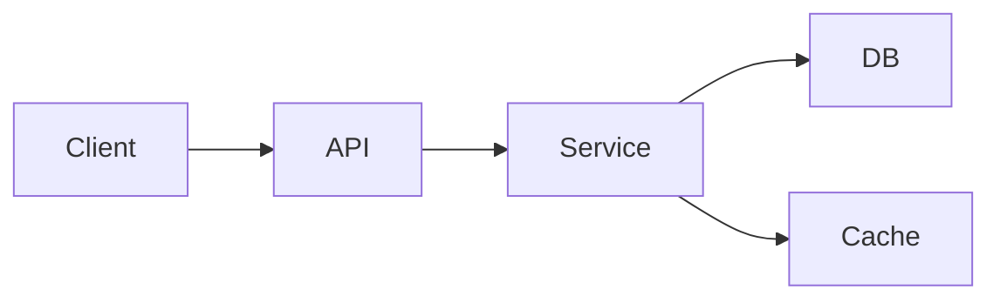
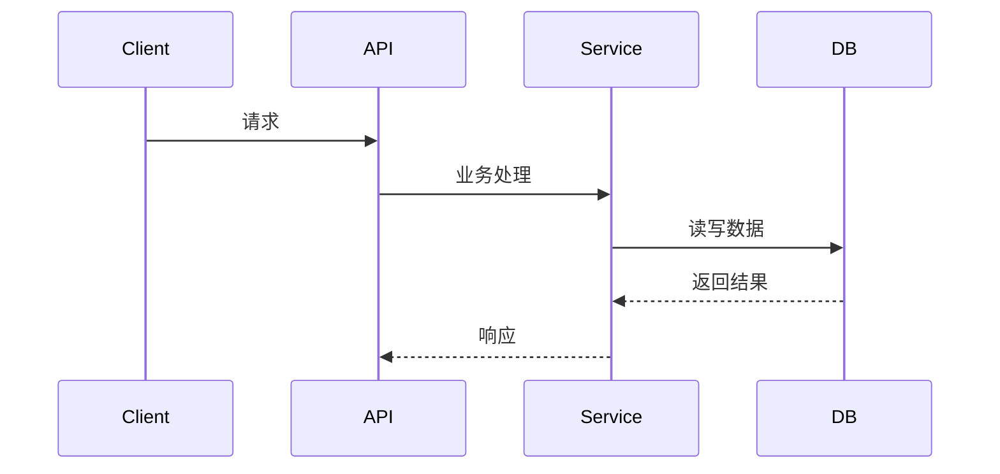

# {主题} 技术设计

> 先让读者在开头看懂三件事：准备怎么做、为什么这样做、怎么验证。
> 写法尽量直白。遇到术语、缩写或英文词，第一次出现先解释；对当前文档没帮助的章节可以删掉。

**文档名建议**：`<主题>_design.md`
**编号（可选）**：DESIGN-XXX
**关联需求（可选）**：REQ-XXX / `<主题>_requirement.md`
**关联 Tasks（可选）**：TASKS-XXX / `<主题>_tasks.md`
**相关 ADR（可选）**：ADR-XXX / 无
**创建日期**：YYYY-MM-DD
**最后更新**：YYYY-MM-DD
**负责人**：
**状态**：草稿 | 评审中 | 已确认 | 已实现

---

## 1. 这次怎么做

### 要解决的问题
需要解决的技术问题是什么。

### 设计目标
- 目标 1
- 目标 2

### 明确不做
- 不负责内容 1
- 不负责内容 2

### 限制条件
- 条件 1
- 条件 2

### 待确认事项

| 类型 | 内容 | 当前状态 |
|------|------|----------|
| 假设 | | 已确认 / 待确认 |
| 问题 | | 已确认 / 待确认 |

---

## 2. 一句话方案

### 先说结论
用 100-200 字说明整体方案、核心权衡和为什么这样设计。

### 架构图

描述模块之间的组成关系和依赖关系。可用 Mermaid、ASCII 或图片嵌入。



### 数据流图（按需）

描述数据在模块间的流转路径。简单项目可省略。



---

## 3. 主要模块与职责

| 组件/模块 | 职责 | 输入/输出 | 依赖 |
|-----------|------|-----------|------|
| | | | |

### 技术栈（可选）

如果本次设计涉及技术选型或技术栈变更，在此记录选型结果和理由。

| 组件 | 技术选择 | 选择理由 |
|------|----------|----------|
| 框架 | | |
| 数据库 | | |
| 缓存 | | |
| 消息队列 | | |
| 其他 | | |

---

## 4. 关键流程

| 流程 | 触发条件 | 主路径 | 失败/回退路径 |
|------|----------|--------|---------------|
| 流程 1 | | | |
| 流程 2 | | | |

如有复杂逻辑，可补充时序或伪代码：

```text
1. 接收输入
2. 验证约束
3. 执行核心逻辑
4. 持久化 / 输出结果
5. 返回响应 / 更新状态
```

---

## 5. 接口、数据与状态（按需填写）

### 外部接口 / 事件 / UI 约定

| 接口/约定名称 | 类型 | 生产方/消费方 | 输入 | 输出 | 备注 |
|---------------|------|---------------|------|------|------|
| | API / Event / UI / CLI / Batch | | | | |

### 数据模型 / 状态变化

| 实体/状态 | 关键字段或变化 | 一致性规则 | 备注 |
|-----------|----------------|------------|------|
| | | | |

---

## 6. 关键设计考量

| 维度 | 设计决策 | 原因 | 验证方式 |
|------|----------|------|----------|
| 错误处理与恢复 | | | |
| 安全与隐私 | | | |
| 性能与容量 | | | |
| 兼容性与迁移 | | | |
| 监控与排查 | | | |

---

## 7. 备选方案与取舍

| 方案 | 思路 | 优点 | 缺点 | 不选原因 |
|------|------|------|------|----------|
| 方案 A | | | | |
| 方案 B | | | | |

---

## 8. 怎么验证

| 验证范围 | 验证方式 | 证据 |
|----------|----------|------|
| 核心业务逻辑 | 单元测试 | |
| 跨模块集成 | 集成测试 | |
| 关键路径 | 手工演示 / E2E | |
| 非功能需求 | 压测 / 安全检查 / 监控 | |

---

## 9. 需求对应关系（可选）

如果项目需要追踪“需求 -> 设计 -> 验证”的对应关系，保留本节；否则可删除。

| Requirement ID | 设计章节 / 组件 | 验证方式 | 备注 |
|----------------|-----------------|----------|------|
| FR-001 | 章节 / 组件名 | 单元测试 / 集成测试 / 演示 | |
| NFR-001 | 章节 / 组件名 | 压测 / 监控 / 检查 | |

---

## 10. 部署与回滚（按需）

如果本次设计涉及部署方式变更、基础设施调整或需要回滚保障，填写本节；否则可删除。

### 部署方案

| 维度 | 方案 |
|------|------|
| 部署架构 | 容器 / VM / Serverless / 静态托管 |
| 配置管理 | 环境变量 / 配置中心 / ConfigMap |
| 监控指标 | |
| 告警规则 | |

### 回滚计划

| 回滚类型 | 触发条件 | 回滚步骤 |
|----------|----------|----------|
| 数据库回滚 | 数据迁移异常 / 数据不一致 | 回滚脚本 / 保留旧表 |
| 服务回滚 | 核心接口错误率上升 / 功能异常 | 回退版本 / 切换流量 |
| 配置回滚 | 配置变更导致服务异常 | 恢复配置快照 |

---

## 11. 交接与落地

详细执行步骤不要写在设计文档里，统一写入 `<主题>_tasks.md`。

- [ ] 设计已覆盖所有 P0/P1 需求
- [ ] 关键约束和假设已明确
- [ ] 需要 ADR 的决策已补齐
- [ ] 部署方案与回滚计划已确认（如涉及）
- [ ] 已创建并链接对应 tasks 文件

---

**变更历史**

| 日期 | 版本 | 变更内容 | 修改人 |
|------|------|----------|--------|
| YYYY-MM-DD | 1.0 | 初始版本 | |
